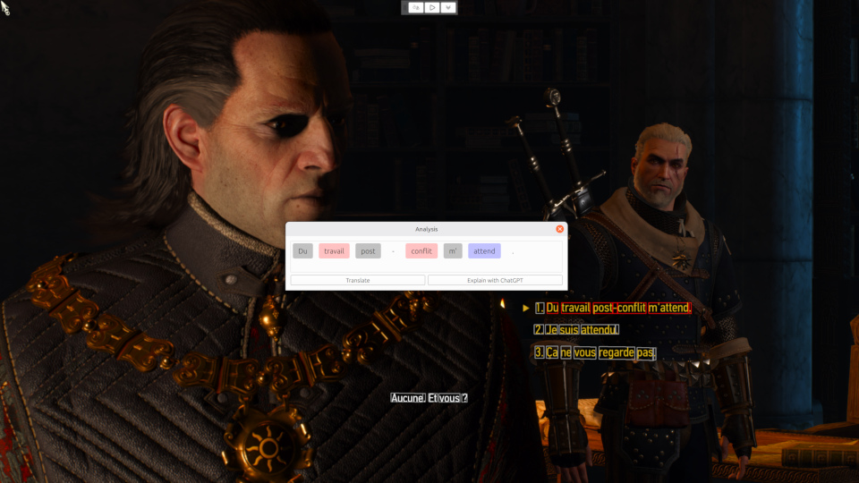

# 
GameTran

Your language assistant in computer games.

GameTran allows you to:
1. **Pause a game** (including "unpausable" cut scenes).
2. **Select words and phrases** to get their translation or ChatGPT explanation, open a dictionary.

The app uses Cloud Vision API for text detection and recognition and Google Cloud Natural Language API for linguistic analysis. For these, you need to provide the API key. Don't worry, it's not difficult and in most cases will cost you nothing. [How to create an API key](docs/api_key.md).

## Compatibility

Tested on Windows and Linux with X11. MacOS and Wayland will be tested later.

## License

GNU General Public License, version 3.

### Button icons

[Fluent System Icons](https://github.com/microsoft/fluentui-system-icons). Licensed under the MIT license.

## Acknowledgements

- [Universal Pause Button](https://github.com/ryanries/UniversalPauseButton) for the idea of "universal pause".
