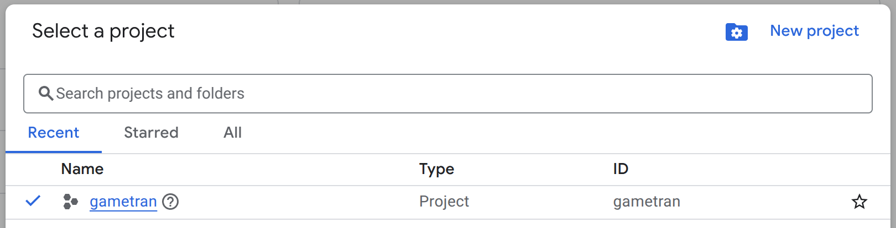
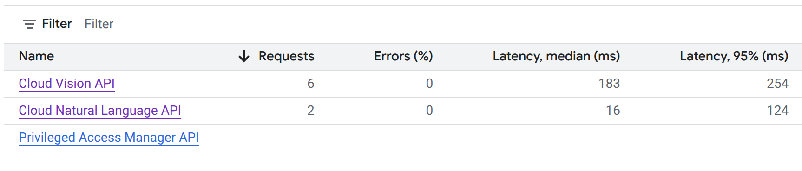
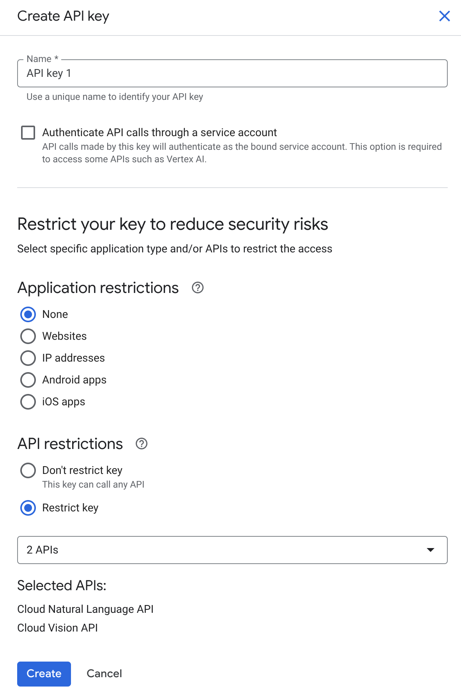
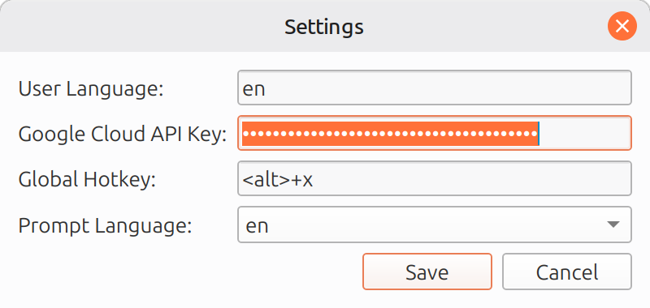

# How to create a Google Cloud API key

GameTran uses [Cloud Vision API](https://docs.cloud.google.com/vision/docs) for text detection and recognition and [Google Cloud Natural Language API](https://docs.cloud.google.com/natural-language/docs) for linguistic analysis. You need to give it the API key. 

## An API key? A credit card? Is it going to be expensive?

No. Up to 1000 pauses/month with up to 5 analysis each will cost you nothing. The next 1000 will cost about $2.5. Please see the [Cloud Vision prices](https://cloud.google.com/vision/pricing) and [Cloud Natural Language prices](https://cloud.google.com/natural-language/pricing).

## How to create a key

1.  If you don't have a Google (Gmail) account, create one.

2. Create a Google Cloud account as explained in [this video](https://www.youtube.com/watch?v=4UeZVLcM1oY).

3. You can set up [billing alerts](https://console.cloud.google.com/billing/017709-1F9BE9-C59792/budgets?project=gametran) if you wish.

4. Create a project, e.g. `gametran`.

5. Go to [Enabled APIs & services](https://console.cloud.google.com/apis/dashboard?project=gametran) and click `+ Enable APIs & services`. You need to add `Cloud Vision API` and `Cloud Natural Language API`.

6. Go to [Credentials](https://console.cloud.google.com/apis/credentials?project=gametran) and click `+ Create credentials` -> `API key`. Make it restricted to the two APIs enabled.

**⚠️ Keep the key protected! ⚠️**

7. Add the key to the field in the GameTran settings (right-click on the tray icon).

